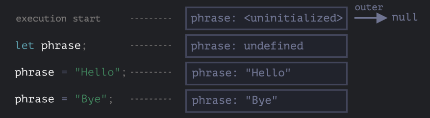
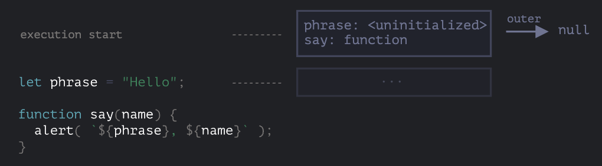
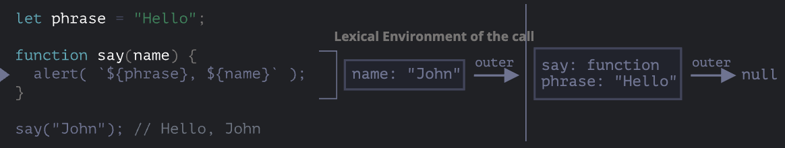
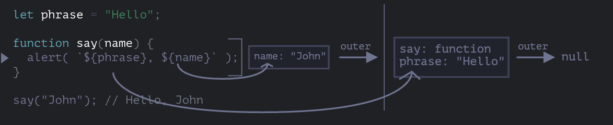
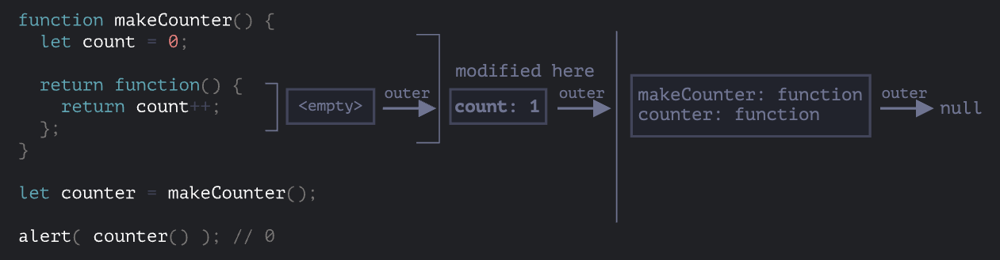

# [변수의 유효범위와 클로저](https://ko.javascript.info/closure)

변수의 유효범위와 클로저에 대해 학습합니다.

## 렉시컬 환경 ( Lexical Environment )

### 1. 변수

- 환경 레코드( Environment Record )
  - 모든 지역 변수를 프로퍼티로 저장하고 있는 객체
  - `this` 값과 같은 기타 정보도 여기에 저장된다.
- 외부 렉시컬 환경 ( Outer Lexical Environment ) 에 대한 참조
  - 바깥 스코프의 코드와 연결
  - 최상위 렉시컬 환경은 전역 레시컬 환경으로 불린다.



1. 스크립트가 시작될 때 선언한 모든 변수가 렉시컬 환경에 등록된다. ( `pre-populated` )

- 이 때 변수의 상태는 `special internal state` 인 `uninitialized` 가 된다.
- 자바스크립트 엔진은 `uninitialized` 상태의 변수를 인지하긴 하지만, `let`을 만나기 전까진 해당 변수를 참조할 수 없다.

2. `let phrase` 구문을 만났지만 값이 할당되지 않았기 때문에 `undefined` 이다.
3. `phrase` 에 값이 할당된다.
4. `phrase` 에 값이 변경된다.

---

### 2. 함수 선언문

- 함수 선언문( function declaration )으로 선언한 함수는 일반 변수와 마찬가지로 값이지만 일반 변수와는 달리 바로 초기화된다는 점에서 차이가 있다.



- 함수가 선언되기 전에도 사용할 수 있는 이유다.
- `let say = function(name)` 혹은 `let say = (name) => {...}` 과 같은 함수 표현식, 화살표 함수 등에서는 해당되지 않는다.
  > [ps. 기존의 함수와 화살표 함수의 차이](https://levelup.gitconnected.com/7-differences-between-arrow-functions-and-regular-functions-in-javascript-9152883a839f)

---

### 3. 내부와 외부 렉시컬 환경

- 함수를 호출하면 새로운 렉시컬 환경이 자동으로 만들어진다.
- 새로운 렉시컬 환경에는 함수 호출 시 넘겨바은 매개변수와 함수의 지역 변수가 저장된다.



- 위 이미지의 내부 렉시컬 환경은 현재 실행 중인 `say` 함수의 내부이다.
- 내부 렉시컬 환경에는 함수의 인자인 `name` 이 있다.
- 외부 렉시컬 환경은 전역 레시컬 환경이고, `say`, `phrase` 를 프로퍼티로 갖는다.
- 내부 렉시컬 환경은 외부 렉시컬 환경에 대한 참조를 갖는다.

```javascript
코드에서 변수에 접근할 때는 "내부 렉시컬 환경"을 검색 범위로 잡는다.
내부 렉시컬 환경에 해당 변수가 없다면, 참조하고 있는 "외부 렉시컬 환경으로 확장"한다.
이 과정은 검색 범위가 "전역 렉시컬 환경으로 확장될 때까지 반복"한다.
```



---

### 4. 함수를 반환하는 함수

- 모든 함수는 함수가 생성된 곳의 `렉시컬 환경`을 기억한다.
- `[[Environment]]` 프로퍼티 덕분에 호출 장소와 상관없이 생성된 곳을 기억할 수 있다.
- `[[Environment]]` 프로퍼티는 함수가 생성될 때 딱 한번 값이 세팅되고 불변하다.

> example

```javascript
function makeCounter() {
  let count = 0

  return function () {
    return count++
  }
}

let counter = makeCounter()
```



- counter 변수에 할당된 익명함수의 렉시컬 환경에는 `counter` 프로퍼티가 없기 때문에
- 외부 렉시켤 환경 ( = 익명함수가 생성될 때의 렉시컬 환경 ) 의 `counter` 을 참조한다.
- 그렇기 때문에 `counter()` 을 수행할 때마다 1씩 증가되는 값을 얻을 수 있다.

## 가비지 컬렉션
- 기본적으로 함수 호출이 끝나면 해당 함수의 렉시컬 환경은 메모리에서 제거된다.
- 하지만 함수 내 중첩함수가 존재한다면 메모리에서 제거되지 않을 수 있다.
- 이유는 중첩함수의 `[[Environment]]` 프로퍼티에서 외부 함수 렉시컬 환경에 대한 정보가 저장되고, 이는 곧 `도달 가능한 상태` 이기 때문이다.
- 위 사유로 주의할 점은 중첩함수를 포함한 상위 함수를 호출하여 어딘가 저장하고 있다면, `각각의 렉시컬 환경이 계속 메모리에 남아있을 수 있다`는 점이다.

### 최적화 프로세스
- 위 내용에도 불구하고, `V8` 엔진에서는 자체적으로 변수 사용을 분석하고 최적화하는 과정이 있어서 의도하지 않은 현상이 생길 수 있다.
- 이러한 부작용을 미리 알아놓으면 좋다.