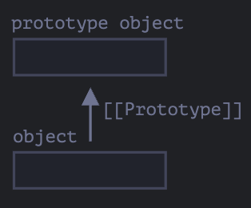
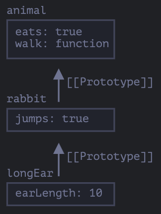

# [프로토타입 상속](https://ko.javascript.info/prototype-inheritance)

자바스크립트 언어의 고유한 기능인 `프로토타입 상속(prototypal inheritance)` 를 이용하면 유사한 기능을 이미 가지고 있는 객체에 조금씩 다른 기능을 추가한 객체를 만들 수 있다.

## [[Prototype]]

- 자바스크립트의 객체는 `[[Prototype]]` 라는 숨김 프로퍼티를 갖는다.
- 이 파라미터는 null 또는 다른 객체에 대한 참조가 되는데, 이 참조 대상을 `프로토타입(prototype)` 라고 부른다.



- `object` 에서 프로퍼티를 찾을 수 없는 경우 자동으로 `프로토타입` 에서 프로퍼티를 찾는다.

- `[[Prototype]]` 프로퍼티는 다양한 방법을 사용해 값을 설정할 수 있다.

```javascript
let animal = {
  eats: true
}

let rabbit = {
  jumps: true
}

rabbit.__proto__ = animal

// 프로퍼티 eats과 jumps를 rabbit에서도 사용할 수 있게 됨
alert( rabbit.eats ); // true
alert( rabbit.jumps ); // true

rabbit 객체에서도 animal 의 프로퍼티 및 메서드를 사용할 수 있게 되었다.
프로토타입에서 상속받은 프로퍼티를 "상속 프로퍼티(inherited property)" 라고 한다.
```

`__proto__` 는 `[[Prototype]]` 의 getter, setter 이다.

하위 호환성 때문에 `__proto__` 를 사용할 순 있지만, 상대적으로 최근에는 `Object.getPrototypeOf` 혹은 `Object.setPrototypeOf` 를 사용한다.

아래 예시처럼 프로토타입 체이닝도 가능하다.

```javascript
let animal = {
  eats: true,
  walk() {
    alert('동물이 걷습니다.')
  },
}

let rabbit = {
  jumps: true,
  __proto__: animal,
}

let longEar = {
  earLength: 10,
  __proto__: rabbit,
}

// 메서드 walk는 프로토타입 체인을 통해 상속
longEar.walk() // 동물이 걷습니다.
alert(longEar.jumps) // true (rabbit에서 상속받음)
```



```javascript
"프로토타입 체이닝의 제약사항"

1. 순환 참조( circular reference ) 는 허용되지 않는다.
2. __proto__ 의 값은 "객체" 또는 "null" 만 가능하고, 다른 자료형은 무시된다.

추가로 객체에는 "[[Prototype]]" 을 하나만 가질 수 있기 때문에 두 개의 객체를 상속받지 못한다.
```

## 프로토타입은 읽기 전용이다

프로토타입의 프로퍼티를 추가, 수정, 삭제 연산은 해당 객체에 직접 해야 한다.
아래 예시를 보면, 프로토타입이 아닌 객체에 추가된다.

```javascript
let animal = {
  eats: true,
  walk() {
    /* rabbit은 이제 이 메서드를 사용하지 않음. */
  },
}

let rabbit = {
  __proto__: animal,
}

rabbit.walk = function () {
  alert('토끼가 깡충깡충 뜁니다.')
}

rabbit.walk() // 토끼가 깡충깡충 뜁니다.
```

하지만, 접근자 프로퍼티( accessor property ) 을 활용하면 조금 다르게 동작한다.

```javascript
let user = {
  name: 'John',
  surname: 'Smith',

  set fullName(value) {
    ;[this.name, this.surname] = value.split(' ')
  },

  get fullName() {
    return `${this.name} ${this.surname}`
  },
}

let admin = {
  __proto__: user,
  isAdmin: true,
}

alert(admin.fullName) // John Smith (*)

// admin 객체에 fullName 프로퍼티가 생기는 게 아니라 user 의 setter 함수가 실행된다.
admin.fullName = 'Alice Cooper' // (**)

alert(admin.fullName) // Alice Cooper, setter에 의해 추가된 admin의 프로퍼티(name, surname)에서 값을 가져옴
alert(user.fullName) // John Smith, 본래 user에 있었던 프로퍼티 값
```

## this 가 나타내는 것

`this` 는 프로토타입에 영향을 받지 않는다.

메서드를 객체에서 호출했든, 프로토타입에서 호출했든 상관없이 `this` 는 언제나 `.` 앞에 있는 객체이다.

즉, `admin.fullName =` 으로 `setter` 함수를 호출할 때, `this` 는 `admin` 이 된다.

따라서 위 예시에서 `admin.fullName = 'Alice Cooper'` 구문을 통해
`admin` 객체 내 `name`, `surname` 프로퍼티가 추가된다.

## for..in 반복문

`for..in` 은 상속 프로퍼티도 순회대상에 포함시킨다.

```javascript
let animal = {
  eats: true,
}

let rabbit = {
  jumps: true,
  __proto__: animal,
}

// Object.keys는 객체 자신의 키만 반환합니다.
alert(Object.keys(rabbit)) // jumps

// for..in은 객체 자신의 키와 상속 프로퍼티의 키 모두를 순회합니다.
for (let prop in rabbit) alert(prop) // jumps, eats
```

`obj.hasOwnProperty(key)` 를 응용하면 상속 프로퍼티를 특정할 수 있다.

```javascript
let animal = {
  eats: true,
}

let rabbit = {
  jumps: true,
  __proto__: animal,
}

for (let prop in rabbit) {
  let isOwn = rabbit.hasOwnProperty(prop)

  if (isOwn) {
    alert(`객체 자신의 프로퍼티: ${prop}`) // 객체 자신의 프로퍼티: jumps
  } else {
    alert(`상속 프로퍼티: ${prop}`) // 상속 프로퍼티: eats
  }
}
```
